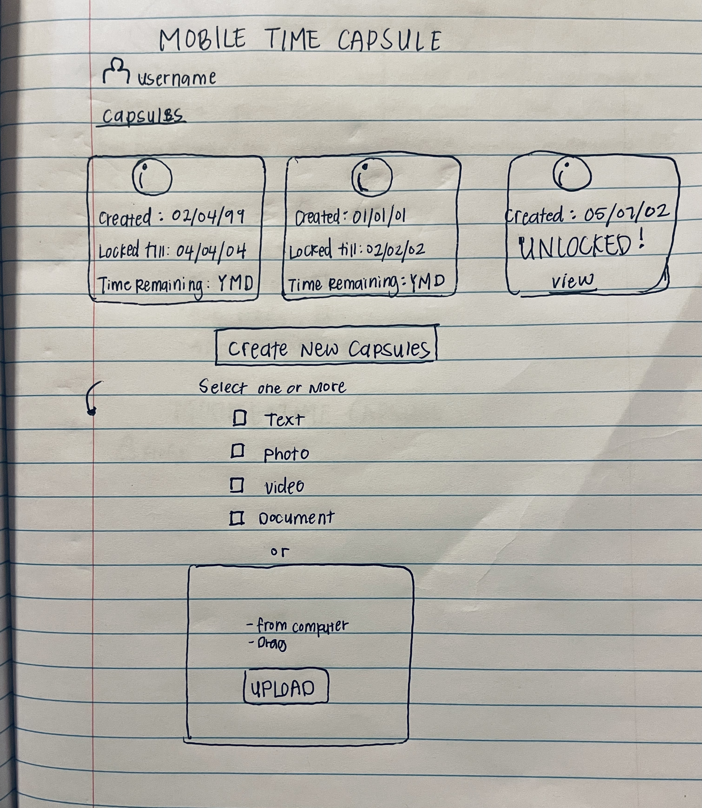

# startup
startup application for BYU CS 260

## Specification Deliverable

### Elevator pitch

Have you ever wanted to keep all of your secrets, thoughts, life challenges, and sentimental valuables to yourself or to hide them from the world? Maybe something like a time capsule. Have you been avoiding it because of the hastle it takes to dig up a hole, mark a specific spot, and remember that exact spot for x amounts of years? The virtual time capsule allows you and/or others you wish to share with, the ability to keep what you want private, private, for how ever long you need. You will be able to upload texts with notes to your future self or other thoughts, photos, videos, and documents that you would love to review and reflect on in the near or far future.

### Design

### Key features

- Display of capsules
- Display of times like created, opens, and time remainting
- Ability to move left and right throught created capsules
- Ability to create new capsules
- Ability to select from variety of files to upload (text, photo, video, docs)

### Technologies

Here is an example of what I hope a Virtual Time Capsule application might include:

- **HTML** - Uses correct HTML structure for application. Two HTML main HTML pages: one for login and one for creating/viewing time capsules.
- **CSS** - Application styling that looks clean and consistent. Uses propper spaceing, color contrast, and simple animations like capsule countdowns
- **JavaScript** - provides login functionality, capsule creation, unlocking capsules, showing countdowns, and calling backend endpoints to save/retrieve capsules.
- **React** - Provides components for capsule creation, viewing, countdowns, and login. Reactivity ensures the timeline and capsules update based on user actions.
- **Service** - Backend service with endpoints for:
  - Retrieving capsules
  - Saving new capsules
  - opening unlocked capsules
- **DB/Login** - Store users and capsule data in the database. Register and login users securely. Useres can only create/view capsules once authenicated.
- **WebSocket** - when a capsule is unlocked, the event is broadcast to users in real-time

## HTML Deliverable

For this deliverable I built the basic structure of what I would like my application to look like using HTML.

- [x] **HTML pages** - Three Pages that 1 allows you to log in, 2 see the capsules you've created, and three add/create new capsules.
- [x] **Links** - The login button automatically links to the capsules page that shows capsules that the user has already created. The 'Create New Capsule' button automatically links to the create capsules page, which allows you submit different files you could submit to your capsule.
- [x] **Text** - each of the capsule descriptions are represented by text.
- [x] **Images** - There is an image of a time capsule in every header of each page.
- [x] **Login** - Login placeholder with a user name displayed
- [x] **Database** - The files submitted in the create capsule page are stored in the capsule page. Also the username and passwords are stored in a database as well
- [x] **WebSocket** - The time remaining and the unlocked capsules are shown in real time, counting down and notifying the user of an unlocked capsule.

## CSS deliverable

For this deliverable I styled it to the best of my abilities.

- [x] **Header, footer, and main content body**
- [x] **Navigation elements** - There is a navigation bar that allows the user to get to all the probided pages. The buttons that also navigate through the pages stand out and are a different color.
- [x] **Responsive to window resizing** - My app has 
- [x] **Application elements** - Used good contrast and whitespace
- [x] **Application text content** - Consistent fonts
- [ ] **Application images** - Still don't have images and so no styling here. 😔